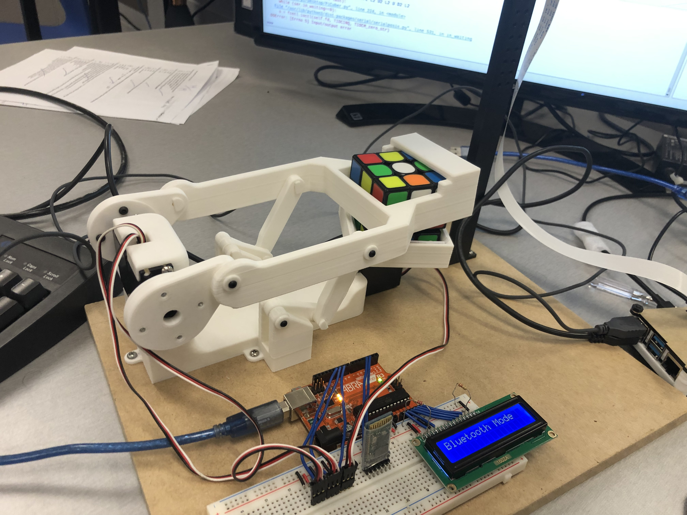
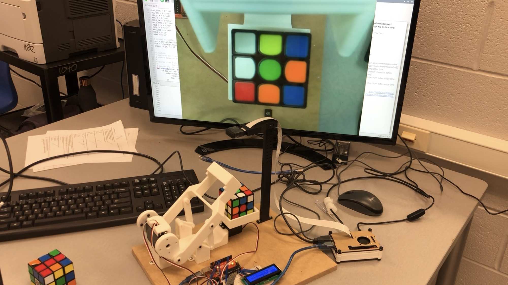

# QBer
QBer is a Rubik's cubing robot that can be manually controlled  by the user via Bluetooth to manipulate any generic cube with three servo motors, while being capable of autonomously detecting and solving the cube.

|  |  |
|-|-|

## Setup

### Python Script
QBer uses Python and the following packages installed by their corresponding script on Raspberry Pi OS to scan and compute a solution for the cube:

[Python 3.10 or later](https://www.python.org/downloads/) as pattern matching is used.

[rubiks-cube-tracker](https://github.com/dwalton76/rubiks-cube-tracker)
to convert an image of a Rubik's cube face into nine RGB values.

    sudo pip3 install git+https://github.com/dwalton76/rubiks-cube-tracker.git

[rubiks-color-resolver](https://github.com/dwalton76/rubiks-color-resolver)
to convert 54 RGB values into nine of six unique colours.

    sudo pip3 install git+https://github.com/dwalton76/rubiks-color-resolver.git

[kociemba](https://github.com/muodov/kociemba)
to compute an efficient Rubik's cube solution.

    sudo apt-get install libffi-dev
    pip install kociemba

### Arduino Sketch
QBer's mobile user interface has been created using the [RemoteXY editor](https://remotexy.com/en/editor/). To compile the Arduino Sketch including the implementation of this UI:

- Install and open the [Arduino IDE](https://www.arduino.cc/en/software)
- Click to the "Sketch" menu and then *Include Library > Manage Libraries*.
- Search for *RemoteXY* and install the latest version.

To connect to QBer on your mobile device, use the RemoteXY mobile app available on http://remotexy.com/en/download/

- for Android 4.11.1 or later;
- and iOS 1.9.1 or later.

### Hardware
You can find detailed information on the tools and materials used in addition to the fabrication procedure in the [report](../docs/report.md) document.

## Contributors
Nabeth Ghazi ([nabethg](https://github.com/nabethg)) — programmer/maintainer

Suyu Chen ([suyu-chen](https://github.com/suyu-chen)) — CAD

## Acknowledgements
[BricKuber Project – A Raspberry Pi Rubiks Cube Solving Robot](https://www.dexterindustries.com/projects/brickuber-project-raspberry-pi-rubiks-cube-solving-robot-project/)

[CUBOTone: a Rubik Cube Solver Robot, With Raspberry Pi and Picamera](https://www.instructables.com/Rubik-Cube-Solver-Robot-With-Raspberry-Pi-and-Pica/)

[NXT LEGO Rubik's Cube Solver](https://grabcad.com/library/nxt-lego-rubik-s-cube-solver-1)

## License
[GNU General Public License Version 3](../LICENSE)