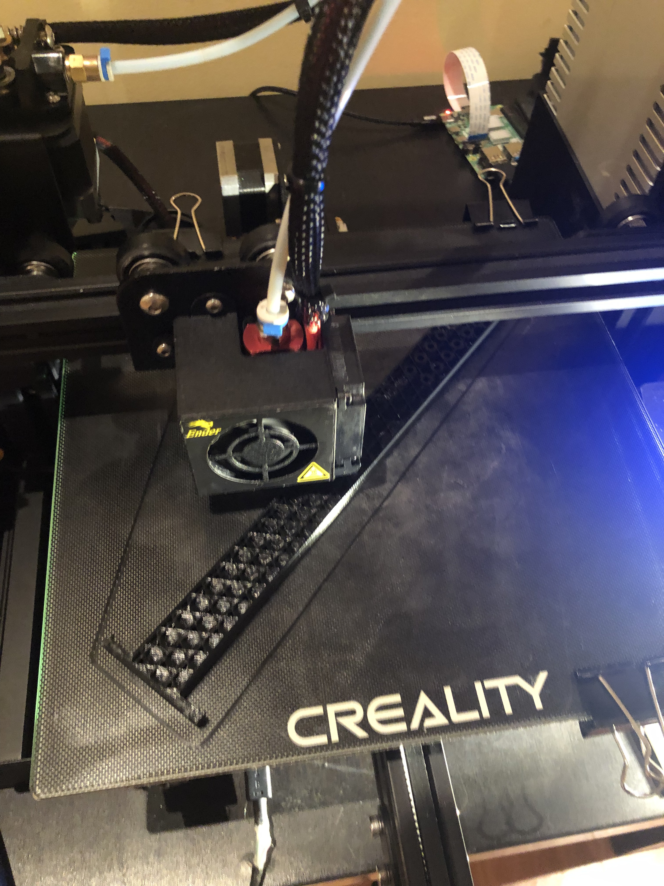

# Project Report: QBer — Rubik's cubing robot

## Description of the project

### Summary
Our project is a Rubik’s cube-solving robot that can scan and manipulate to solve the cube in autonomous mode and be controlled manually by the user in Bluetooth mode.

### Purpose
The purpose of our robot is to automatically detect the patterns on any generic Rubik’s cube and perform the appropriate moves to solve the Rubik’s cube, and in addition be able to respond to manual commands to manipulate the cube. 

### Functionality
Our robot has a rotating platform and an arm controlled by an Arduino, which together are able to flip the cube in any orientation and rotate any of the faces. The arm is moved by two standard servo motors, and it contains multiple joints that allow the arm to flip the cube onto its face just by rotating the two servo motors. The arm can also be released to avoid blocking the camera and allow the rotating platform the rotate the cube freely. Finally, the arm can be held down to hold onto the top two layers of the cube while the bottom layer is rotated by the rotating base, allowing the robot to rotate one of the faces of the cube.

In Bluetooth mode, the robot receives commands using Bluetooth and follows these commands to move the different motors on the cube. In autonomous mode, the robot uses a Raspberry Pi camera to take pictures of all faces of the cube, and a Raspberry Pi processes the images to detect the patterns on the cube and applies an algorithm to determine steps for solving the cube. These steps are then transmitted to the Arduino via Serial so that the Arduino can perform the actions to solve the cube.

## Background

### Circuit Diagram

### Remote Control UI

### 3D Renders
| |  |
|-|-|
| |  |

### Progress Photos
| |  | |
|-|-|-|
| |  | |
| |  | |
| |  | |

### Tools and Materials
- Raspberry Pi 4 Model B ([Datasheet](https://datasheets.raspberrypi.com/rpi4/raspberry-pi-4-datasheet.pdf))	
    - An inexpensive, small computer that can be used to host a server, control various electronic devices, or perform computations
- Raspberry Pi Camera ([Datasheet](https://datasheets.raspberrypi.com/camera/raspberry-pi-camera-guide.pdf), [Schematic](https://datasheets.raspberrypi.com/camera/camera-v2-schematics.pdf))
    - Commonly used with a Raspberry Pi to take pictures or record video, for example as a security camera system or a monitoring system.
- Raspberry Pi Camera Cable (compatible with the Raspberry Pi used)
    - Used to connect a Raspberry Pi to a compatible camera module.
- 5V USB power supply for Raspberry Pi (compatible with the Raspberry Pi used)
    - Used to convert power from the AC wall outlet to stable 5V DC to power a device requiring 5V power such as a Raspberry Pi
- ABRAUNO Arduino Uno R3 ([Datasheet](https://docs.arduino.cc/resources/datasheets/A000066-datasheet.pdf))
    - A microcontroller is commonly used to control various electronic devices such as LEDs, motors, sensors, etc. in order to build various electronic projects
- Parallax Continuous Rotation Servo ([Datasheet](https://docs.rs-online.com/870b/0900766b8123f8a1.pdf))
    - Used in robotics projects when bidirectional continuous rotation is required
- 2x Parallax Standard Servo ([Datasheet](https://docs.rs-online.com/0e85/0900766b8123f8d7.pdf))
    - Provides 180° range of motion and position control to robotics projects.
- HC-05 Bluetooth module ([Datasheet](https://components101.com/sites/default/files/component_datasheet/HC-05 Datasheet.pdf))
    - Used to transport wireless serial connection to the Arduino board.
- LCD 16 x 2 ([Datasheet](https://www.sparkfun.com/datasheets/LCD/ADM1602K-NSW-FBS-3.3v.pdf))
    - Used to display text output on a hardware display.
- USB 2.0 Cable Type A/B (generic)
    - Used to connect a device with a USB type-A port to a device with a USB type B port, providing power and allowing for data transmission
- Breadboard (generic)
    - Used to connect electronic devices and quickly wire them together
- Wires (generic)
    - Used to provide electrical connections
- 3D designed and printed components (white PLA and black PETG filament)
    - Custom made parts for the various parts of the robot, including the arm, servo mounts, and platform used to manipulate the cube and secure the servos
- MDF board (with appropriate dimensions to hold screws and components)
    - Used to mount all components
- Appropriate screws (small wood screws, M3x10mm and M2.5x10mm)
    - Used to hold components such as 3D printed parts/MDF board and motors together.

## Experimental Procedure

### Fabrication
To build the robot, first, all of the 3D printed components needed to be designed in Fusion 360 (a CAD program) and printed on a 3D printer. These components included the arm, all of the joints of the arm, the rotating platform, and the servo mounts. 

After the 3D printed components were made, they were assembled together according to the CAD model. The 3D printed base and the camera stand were screwed onto the MDF board using small wood screws, which required pre-drilling pilot holes with a drill bit prior to screwing. After that, the servo horns for the arm motors needed to be secured to the arm, and the rotating platform needed to also be secured to a servo horn. In both cases, this was done by screwing two 3D printed components together and sandwiching the servo horn in between. With the servo horns attached, the servos themselves could be mounted onto the base using screws and the horns attached. After this, the camera could be placed inside the camera mount, and that could be secured onto the camera stand at the appropriate height using two M3 screws.

The last step in the assembly was calibrating the arm position and timing of the rotation of the rotating base. To flip the cube properly, the arm would had to move between specific positions, and the rotating base had to rotate for specific amounts of time to rotate the cube 90 degrees at a time.

### Sensors and Motors
The robot used three servo motors. The rotating platform used one continuous rotation servo motor to rotate, and the arm was moved by two standard servo motors working together.

Moreover a Raspberry Pi Camera was used to take pictures of the patterns on the cube and an HC-05 Bluetooth module for detecting Bluetooth signals from a phone for manual control.

### Trouble Shooting 
We encountered several problems when building the robot. One of the first issues was that while the servo mounts were designed to use M4 screws to mount the servos, we did not have any M4 screws available. We were able to find enough screws to secure the two servos used for controlling the arm but were not able to find any screws that could secure the servo for the rotating base. Without the appropriate screws, the base was not completely secure and could wobble somewhat. This problem was overcome by simply holding the servo in place while the robot was working, ensuring that it would not wobble.

Another issue we encountered was that the continuous servo motor used to rotate the platform was inconsistent and would not always rotate the same amount given the same time. This would result in the platform gradually becoming crooked, and eventually, it would be misaligned enough that the arm would be unable to flip the cube. Unfortunately, we did not have enough time to properly solve this problem, but an interim solution was to increase the delay between moves, which allowed time to manually fix any misalignments as the robot was solving the cube.

## Outcome
The robot was able to successfully solve the cube in autonomous mode and was correctly controlled using Bluetooth. The camera system worked well, and the robot was able to determine the correct steps for solving the cube. However, since the servo motors used were not able to consistently turn the cube at the same angle, the cube had to be regularly realigned manually while the robot was solving the cube in autonomous mode. Fine-tuning is still required for the robot to work entirely independently of the user’s correction of the motor movements.

The main causes of the inaccurate turning of the cube can be attributed to the use of a continuous servo without any position encoder, which meant that the robot would never be aware of the real-life position of the rotating platform and that the 3D printed rotating platform was slightly too large in relation to the size of the available Rubik’s cube. This problem could potentially be solved by 3D printing a new rotating platform with smaller dimensions and by using a high torque stepper motor instead of a continuous servo motor, which would be able to maintain more accurate positioning.

## Reference Designs
[BricKuber Project – A Raspberry Pi Rubiks Cube Solving Robot](https://www.dexterindustries.com/projects/brickuber-project-raspberry-pi-rubiks-cube-solving-robot-project/)

[CUBOTone: a Rubik Cube Solver Robot, With Raspberry Pi and Picamera](https://www.instructables.com/Rubik-Cube-Solver-Robot-With-Raspberry-Pi-and-Pica/)

[NXT LEGO Rubik's Cube Solver](https://grabcad.com/library/nxt-lego-rubik-s-cube-solver-1)
